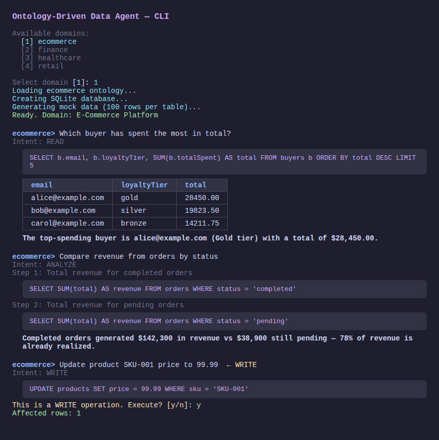
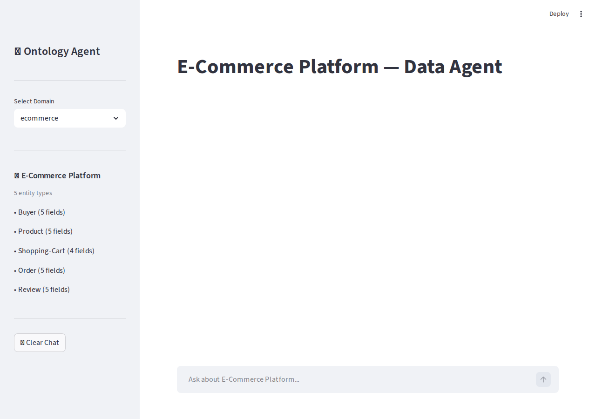
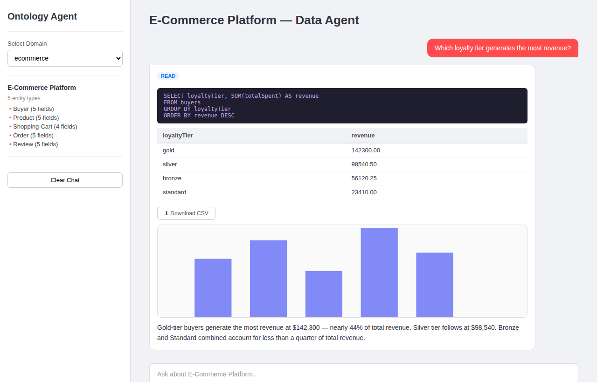

# 本体驱动的数据智能体

[English](README.md) | 中文

基于 [Palantir AIP](https://www.palantir.com/platforms/aip/) 理念构建的数据智能体。通过 OWL/RDF 本体文件理解业务领域语义，自动生成带真实感数据的 SQLite 数据库，让用户以自然语言查询和操作数据。

> **操作即决策。** 这不是一个只读的报表工具——智能体可以在用户确认后提议并执行写操作，完全对齐 Palantir AIP "Agent 应该能够采取行动"的设计哲学。

---

## 截图

### CLI —— 域选择、READ / ANALYZE / WRITE


### Web UI —— 启动页（域选择器 + 实体概览）


### Web UI —— 查询结果 + 自动图表 + CSV 导出


---

## 项目目标

| 目标 | 说明 |
|------|------|
| 自然语言 → SQL | 用户用中文或英文提问，智能体识别意图、生成 SQL、执行并返回格式化答案 |
| 本体感知 | 领域语义来自 OWL/RDF 文件——智能体理解实体类型、属性和关系，无需硬编码任何 schema |
| 权限管控写操作 | READ 查询自动执行；WRITE/DELETE 需用户确认；DDL（DROP/ALTER）直接拒绝 |
| 多步骤分析 | 复杂问题拆解为多个子查询，分别执行后综合成统一答案 |
| 可插拔 LLM 后端 | Vertex AI Gemini、OpenAI、OpenRouter 或本地 Ollama——改 `config.yaml` 即可切换，无需改代码 |

---

## 设计哲学——为什么是本体？

这个项目源于对"Palantir AIP 与传统数据工具的本质区别"的思考。核心洞见在于两种范式对**数据关系**的处理方式截然不同。

### 传统 ETL vs. Palantir Ontology

**传统 ETL 思路：**
```
原始数据 → 清洗转换 → 写入目标表 → 查询
          （数据关系在物理层预先固化到 schema 中）
```

**Palantir Ontology 思路：**
```
原始数据 ──映射──► 语义层（Ontology） ──► 查询 / AI Action
                  （关系在语义层动态定义，源数据不动）
```

Ontology 层定义的四个核心概念：

| 概念 | 说明 | 示例 |
|------|------|------|
| **Object Type**（对象类型） | 业务实体，类似"类" | `Employee`、`Contract`、`Patent` |
| **Property**（属性） | 映射到源表某一列 | `Employee.name → hr_table.full_name` |
| **Link Type**（关联类型） | 跨任意数据源的虚拟关联 | `Employee → WORKS_ON → Project` |
| **Action**（动作） | 可作用于对象的操作 | `approve_contract(Contract)` |

### ETL vs. Ontology 对比

|  | 传统 ETL | Palantir Ontology |
|--|----------|-------------------|
| **是否需要预处理** | 数据物理清洗 + 合并 | 语义映射（仍需预定义） |
| **关系变更成本** | 重跑整条 pipeline | 修改 Ontology 定义（低成本，立即生效） |
| **数据是否移动** | 是——写入新表 | 否——虚拟查询源数据 |
| **灵活性** | 低（schema 固化） | 高（语义层随时可扩展） |
| **谁来定义关系** | 数据工程师 | 业务/数据分析师 |

> **没有消除的前提：** 你仍然需要有人做"语义映射"——告诉系统 `hr_table.emp_id` 对应 `Employee` 对象的哪个 property。只是这个工作从"跑 ETL pipeline"变成了"配置 Ontology 定义"，门槛低很多，也可以随时修改。

### 更深层的架构意义

Palantir 的真正突破是**把关系提升为一等公民，与物理存储解耦**：

```
传统思路：关系 = 外键 / JOIN（存在于物理数据层）
Ontology：关系 = Link Type（存在于语义层，可跨任意数据源）
```

示例——三个完全独立的数据源，在 Ontology 中统一：

```
Employee（来自 HR 系统）
  └─ INVENTED ──► Patent    （来自专利数据库）
  └─ SIGNED   ──► Contract  （来自合同管理系统）
```

这三个数据源可能永远不会物理合并，但 Ontology 在语义层将它们连接起来，AIP 的 LLM 可以直接在这个统一视图上推理。

这本质上是**数据虚拟化 + 知识图谱 + AI Action 的融合**——学术上接近语义网（RDF/OWL）的工程化落地。

### 本项目的对应实现

| Palantir 概念 | 本项目的实现 |
|---------------|-------------|
| Object Type | RDF 文件中的 `owl:Class` → SQLite 表 |
| Property | `owl:DatatypeProperty` → 表的列 |
| Link Type | `owl:ObjectProperty` → 外键 / 关联表 |
| Action | WRITE intent → 权限管控的 SQL 执行 |
| 语义层 | `src/ontology/parser.py` + `src/ontology/context.py` |
| LLM 在本体上推理 | LangGraph agent + 基于 ontology context 的 LLM SQL 生成 |

---

## LLM 提供商

所有 LLM 调用都通过统一的 `LLMClient` 协议抽象。内置支持四个提供商：

| 提供商 | 密钥 | 适用场景 |
|--------|------|----------|
| **Vertex AI Gemini** | GCP 服务账号 | GCP 生产环境；Gemini 2.x / 3.x 系列 |
| **OpenRouter** | `OPENROUTER_API_KEY` | 一个 key 访问 200+ 模型（Claude、GPT-4o、Llama、Gemini、Mistral……） |
| **OpenAI** | `OPENAI_API_KEY` | 直接使用 GPT-4o、o1、o3-mini 等 |
| **Ollama** | 无需 key | 完全本地运行，离线可用；开源模型（Llama 3、Qwen、Mistral……） |

### OpenRouter

[OpenRouter](https://openrouter.ai) 是兼容 OpenAI 接口的模型网关，聚合了 200+ 模型提供商。无需管理多个 API key，是多模型横向对比实验的最佳选择。

```yaml
# config.local.yaml  （已 gitignore，可安全存放 API key）
llm:
  provider: openrouter

openrouter:
  api_key: "sk-or-v1-..."              # https://openrouter.ai/keys
  model: anthropic/claude-3.5-sonnet   # openrouter.ai/models 中的任意模型
  app_name: ontology-aip-agent
```

常用 OpenRouter 模型 ID：

| 模型 | ID |
|------|----|
| Claude 3.5 Sonnet | `anthropic/claude-3.5-sonnet` |
| GPT-4o | `openai/gpt-4o` |
| Gemini 2.0 Flash | `google/gemini-2.0-flash-exp` |
| Llama 3.3 70B | `meta-llama/llama-3.3-70b-instruct` |
| Mistral Large | `mistralai/mistral-large` |
| DeepSeek V3 | `deepseek/deepseek-chat` |

### OpenAI

```yaml
llm:
  provider: openai

openai:
  api_key: "sk-..."    # https://platform.openai.com/api-keys
  model: gpt-4o        # 或 gpt-4o-mini、o1、o3-mini 等
```

### Vertex AI Gemini

```yaml
llm:
  provider: vertex
  model: gemini-3.1-pro-preview

vertex:
  project: YOUR_GCP_PROJECT_ID
  location: global
  credentials: /path/to/service-account.json
```

### Ollama（本地）

```yaml
llm:
  provider: ollama
  model: llama3          # 需先执行：ollama pull llama3

ollama:
  host: http://localhost:11434
```

> **安全提示：** API key 严禁提交到 git。请使用 `config.local.yaml`（已 gitignore）或环境变量存储密钥，参见[配置参考](#配置参考)。

---

## 架构

```
┌──────────────────────────────────────────────────────────────┐
│                      用户界面                                 │
│         CLI（rich）              Web UI（Streamlit）          │
└──────────────────┬───────────────────────┬───────────────────┘
                   │                       │
                   └──────────┬────────────┘
                              ▼
┌──────────────────────────────────────────────────────────────┐
│                    LangGraph 智能体                           │
│                                                              │
│  load_context → classify_intent                              │
│                    ├─[READ/WRITE]→ generate_sql              │
│                    │                  → execute_sql           │
│                    │                  → format_result         │
│                    ├─[ANALYZE] → plan_analysis               │
│                    │              → execute_analysis_step(×N) │
│                    │              → synthesize_results        │
│                    └─[UNCLEAR] → clarify（最多 2 次）/ give_up│
└──────┬────────────────────┬────────────────────┬────────────┘
       │                    │                    │
       ▼                    ▼                    ▼
┌─────────────┐   ┌──────────────────────────────────────┐  ┌──────────────────┐
│  本体存储    │   │    LLM 客户端（可插拔）               │  │   SQL 执行器     │
│  (RDF/OWL)  │   │  ┌──────────┐  ┌──────────────────┐  │  │   （SQLite）     │
└─────────────┘   │  │ Vertex AI│  │ OpenAI 兼容接口  │  │  │   + 权限管控    │
                  │  │  Gemini  │  │ OpenAI/OpenRouter│  │  └──────────────────┘
                  │  └──────────┘  └──────────────────┘  │
                  │  ┌──────────┐                         │
                  │  │  Ollama  │  （本地，无需 API key）  │
                  │  └──────────┘                         │
                  └──────────────────────────────────────┘
```

### 组件说明

| 组件 | 文件 | 职责 |
|------|------|------|
| **本体解析器** | `src/ontology/parser.py` | RDF/OWL → `OntologySchema` 数据类 |
| **上下文生成器** | `src/ontology/context.py` | Schema → 注入 LLM prompt 的纯文本描述 |
| **智能体图** | `src/agent/graph.py` | LangGraph `StateGraph`，带条件路由 |
| **智能体节点** | `src/agent/nodes.py` | `classify_intent`、`generate_sql`、`execute_sql_node`、`format_result`、`plan_analysis`、`execute_analysis_step`、`synthesize_results` |
| **SQL 执行器** | `src/database/executor.py` | `BaseExecutor` ABC + `SQLiteExecutor`；权限管控；5 秒超时 |
| **模拟数据** | `src/database/mock_data.py` | 基于 Faker 的数据生成，自动关联外键 |
| **LLM 抽象层** | `src/llm/base.py` | `LLMClient` 协议——所有提供商实现此接口 |
| **Vertex AI 客户端** | `src/llm/vertex.py` | 通过 `google-cloud-aiplatform` 调用 Gemini |
| **OpenAI 兼容客户端** | `src/llm/openai_compat.py` | OpenAI 和 OpenRouter 共用，通过 `base_url` 区分 |
| **Ollama 客户端** | `src/llm/ollama.py` | 通过 Ollama REST API 调用本地模型 |
| **CLI** | `src/cli/app.py` | 域选择、对话循环、rich 格式化输出 |
| **Web UI** | `src/web/app.py` | Streamlit 聊天界面 |
| **可视化器** | `src/web/visualizer.py` | 自动检测图表类型（bar/line/pie/area/stacked_bar），Plotly 渲染 |
| **数据连接器** | `src/database/connectors.py` | `DataConnector` ABC + `MockMarketPriceConnector`（外部数据模拟） |

### 意图路由

```
用户查询
    │
    ▼
classify_intent（LLM）
    ├─ READ    → 单条 SELECT → 格式化答案
    ├─ WRITE   → INSERT/UPDATE → 用户确认 → 执行
    ├─ ANALYZE → 拆解为 2~4 个子查询 → 逐一执行 → 综合结果
    └─ UNCLEAR → 追问澄清（最多 2 次重试）
```

### 权限级别

| 级别 | 操作 | 默认行为 |
|------|------|----------|
| `auto` | SELECT、WITH | 自动执行 |
| `confirm` | INSERT、UPDATE、DELETE | 提示用户 y/n 确认 |
| `deny` | DROP、CREATE、ALTER、TRUNCATE | 始终拒绝 |

---

## 快速开始

### 前置条件

- Python 3.11+
- 选择一个 LLM 提供商（见 [LLM 提供商](#llm-提供商)）

### 安装

```bash
git clone https://github.com/ordiy/ontology-aip-agent.git
cd ontology-aip-agent
python -m venv .venv && source .venv/bin/activate
pip install -e .
```

### 配置

```bash
cp config.yaml config.local.yaml   # 已 gitignore，可安全存放 API key
```

编辑 `config.local.yaml`，填入你选择的 LLM 提供商配置（参见 [LLM 提供商](#llm-提供商)）。

### 运行

**CLI：**
```bash
python -m src
```

**Web UI：**
```bash
streamlit run src/web/app.py
# 访问 http://localhost:8501
```

---

## 测试数据

无需外部数据库。启动时智能体自动：

1. 解析选定的本体 RDF 文件
2. 根据 schema 创建 SQLite 数据库
3. 用 Faker 生成模拟数据（行数可配置）

### 本体领域

| 领域 | 文件 | 实体 |
|------|------|------|
| **电商** | `ontologies/ecommerce.rdf` | Buyer（买家）、Product（商品）、Shopping-Cart（购物车）、Order（订单）、Review（评价） |
| **金融** | `ontologies/finance.rdf` | Account（账户）、Transaction（交易）、Portfolio（投资组合）、Asset（资产）、Statement（账单） |
| **零售** | `ontologies/retail.rdf` | Customer（客户）、Product（商品）、Store（门店）、Order（订单）、Inventory（库存） |
| **医疗** | `ontologies/healthcare.rdf` | Patient（患者）、Doctor（医生）、Appointment（预约）、Prescription（处方）、Diagnosis（诊断） |
| **制造** | `ontologies/manufacturing.rdf` | Product（产品）、Component（零件）、Supplier（供应商）、WorkOrder（工单）、Inventory（库存） |
| **教育** | `ontologies/education.rdf` | Student（学生）、Course（课程）、Instructor（讲师）、Enrollment（选课）、Grade（成绩） |

### Ontology → 数据库映射

| OWL 概念 | SQLite 映射 |
|----------|-------------|
| `owl:Class` | TABLE，自动生成 `id` 主键 |
| `owl:DatatypeProperty`（string） | TEXT |
| `owl:DatatypeProperty`（integer） | INTEGER |
| `owl:DatatypeProperty`（decimal/float） | REAL |
| `owl:DatatypeProperty`（date/dateTime） | TEXT（ISO 8601） |
| `owl:DatatypeProperty`（boolean） | INTEGER（0/1） |
| `owl:ObjectProperty`（1:N） | N 端表的 FK 列 `{entity}_id` |
| `owl:ObjectProperty`（M:N） | 关联表 `{table_a}_{table_b}` |

### 数据量配置

```yaml
database:
  mock_rows_per_table: 100   # 每张实体表生成的行数
```

---

## 使用说明

### CLI 命令

| 命令 | 说明 |
|------|------|
| `<自然语言>` | 用中文或英文提问或下达指令 |
| `.tables` | 列出当前域的所有表 |
| `.schema <表名>` | 查看表的列结构 |
| `.ontology` | 打印本体关系图 |
| `.history` | 查看对话历史 |
| `.history clear` | 清除对话历史 |
| `.switch <域名>` | 切换到其他本体域 |
| `.switch` | 列出所有可用域 |
| `.quit` | 退出 |

### 示例查询

```
ecommerce> 哪个买家下单次数最多？
ecommerce> 显示库存低于 10 的所有商品
ecommerce> 对比本月和上月的营收差异      ← ANALYZE 意图
ecommerce> 把订单 #42 的状态改为已发货   ← WRITE（需要用户确认）
```

### Web UI 功能

- 聊天式界面，保留完整对话历史
- 查询结果自动渲染为数据表格
- 每次查询结果附带 **CSV 导出**按钮
- **自动图表**——根据数据特征智能选择：
  - `bar`（柱状图）——分类列 + 单个数值列
  - `pie`（饼图）——分类数 ≤8 且均为正值
  - `line`（折线图）——日期/时间列 + 数值列
  - `area`（面积图）——累计时间序列（单调递增或列名含 `total`/`sum`）
  - `stacked_bar`（堆叠柱状图）——2 个分类列 + 1 个数值列

---

## 项目结构

```
ontology-aip-agent/
├── config.yaml                  # 主配置文件（不含密钥）
├── config.local.yaml            # 本地密钥配置（已 gitignore）
├── pyproject.toml
├── ontologies/                  # OWL/RDF 本体定义文件
│   ├── ecommerce.rdf
│   ├── finance.rdf
│   ├── retail.rdf
│   ├── healthcare.rdf
│   ├── manufacturing.rdf
│   └── education.rdf
├── src/
│   ├── config.py                # 配置加载（yaml + 环境变量覆盖）
│   ├── ontology/
│   │   ├── parser.py            # RDF/OWL → OntologySchema 数据类
│   │   └── context.py           # Schema → LLM prompt 文本
│   ├── database/
│   │   ├── schema.py            # Schema → SQLite DDL + 建表
│   │   ├── mock_data.py         # Faker 模拟数据生成
│   │   ├── executor.py          # BaseExecutor ABC + SQLiteExecutor
│   │   └── connectors.py        # DataConnector ABC + MockMarketPriceConnector
│   ├── agent/
│   │   ├── graph.py             # LangGraph StateGraph
│   │   ├── nodes.py             # 所有智能体节点函数
│   │   └── state.py             # AgentState TypedDict
│   ├── llm/
│   │   ├── base.py              # LLMClient 协议
│   │   ├── vertex.py            # Vertex AI Gemini 客户端
│   │   ├── openai_compat.py     # OpenAI + OpenRouter 共用客户端
│   │   └── ollama.py            # Ollama 本地模型客户端
│   ├── cli/
│   │   └── app.py               # CLI 入口
│   └── web/
│       ├── app.py               # Streamlit Web UI
│       └── visualizer.py        # Plotly 图表类型检测 + 渲染
├── tests/                       # 111 个测试（pytest）
│   ├── test_parser.py
│   ├── test_schema.py
│   ├── test_executor.py
│   ├── test_agent.py
│   ├── test_web.py
│   ├── test_connectors.py
│   └── test_openai_compat.py
└── docs/
    └── superpowers/
        ├── specs/               # 设计文档
        └── plans/               # 实现计划
```

---

## 运行测试

```bash
pytest
# 111 passed
```

---

## 配置参考

| 配置项 | 默认值 | 说明 |
|--------|--------|------|
| `llm.provider` | `vertex` | `vertex` \| `openai` \| `openrouter` \| `ollama` |
| `llm.model` | `gemini-3.1-pro-preview` | 模型名称（vertex 提供商使用） |
| `llm.temperature` | `0.0` | LLM 采样温度 |
| `vertex.project` | — | GCP 项目 ID |
| `vertex.location` | `global` | Vertex AI 区域 |
| `vertex.credentials` | — | 服务账号 JSON 路径 |
| `openai.api_key` | — | OpenAI API Key |
| `openai.model` | `gpt-4o` | OpenAI 模型 ID |
| `openai.base_url` | `https://api.openai.com/v1` | API 基础 URL |
| `openrouter.api_key` | — | OpenRouter API Key |
| `openrouter.model` | `anthropic/claude-3.5-sonnet` | 模型 ID（见 openrouter.ai/models） |
| `openrouter.base_url` | `https://openrouter.ai/api/v1` | API 基础 URL |
| `openrouter.app_name` | `ontology-aip-agent` | 发送至 `X-Title` 请求头的应用名 |
| `ollama.host` | `http://localhost:11434` | Ollama 服务地址 |
| `ollama.model` | `llama3` | Ollama 模型名称 |
| `ollama.timeout` | `120` | 请求超时（秒） |
| `database.path` | `./data/` | SQLite 数据库目录 |
| `database.mock_rows_per_table` | `100` | 每张表生成的行数 |
| `permissions.read` | `auto` | SELECT 权限模式 |
| `permissions.write` | `confirm` | INSERT/UPDATE 权限模式 |
| `permissions.delete` | `confirm` | DELETE 权限模式 |
| `permissions.admin` | `deny` | DDL 权限模式 |

### 环境变量

所有 API key 均可通过环境变量设置，优先级高于 `config.yaml` 和 `config.local.yaml`：

```bash
# 提供商选择
export LLM_PROVIDER=openrouter          # vertex | openai | openrouter | ollama
export LLM_MODEL=anthropic/claude-3.5-sonnet

# OpenRouter
export OPENROUTER_API_KEY=sk-or-v1-...

# OpenAI
export OPENAI_API_KEY=sk-...

# Vertex AI
export GOOGLE_CLOUD_PROJECT=my-project
export GOOGLE_APPLICATION_CREDENTIALS=/path/to/creds.json
```

---

## 参考资料

| 资源 | 链接 |
|------|------|
| Palantir AIP —— 本体与智能体 | https://www.palantir.com/platforms/aip/ |
| Microsoft Ontology-Playground（RDF 领域文件来源） | https://github.com/microsoft/Ontology-Playground |
| LangGraph 文档 | https://langchain-ai.github.io/langgraph/ |
| rdflib（Python RDF 库） | https://rdflib.readthedocs.io/ |
| OWL Web 本体语言（W3C） | https://www.w3.org/OWL/ |
| Vertex AI Gemini API | https://cloud.google.com/vertex-ai/generative-ai/docs |
| OpenRouter —— 模型目录 | https://openrouter.ai/models |
| OpenRouter —— API 文档 | https://openrouter.ai/docs |
| OpenAI API 参考 | https://platform.openai.com/docs/api-reference |
| Ollama | https://ollama.com |
| Streamlit | https://streamlit.io |
| Faker（模拟数据） | https://faker.readthedocs.io/ |
| Plotly Express | https://plotly.com/python/plotly-express/ |
